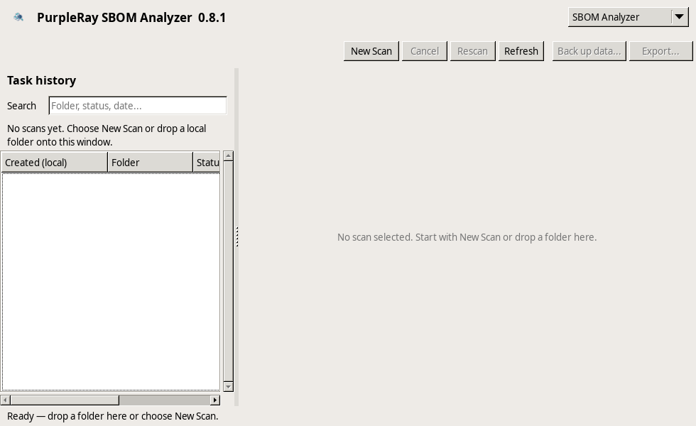

# PurpleRay SBOM Analyzer

PurpleRay SBOM Analyzer is a small, native desktop application that inventories
local software artifacts and produces deterministic CycloneDX 1.7 JSON. The
serializer retains tested CycloneDX 1.6 compatibility. It scans without network
access by default and never executes files from the selected folder. An
explicit, per-scan OSV.dev check can send only eligible versioned Package URLs
after the inventory SBOM has been written; it is unchecked again every time.
The same bounded check can be manually refreshed for a completed desktop scan
after a separate per-use confirmation, without rescanning the target.
Its native parsers read each artifact through one verified, size-bounded input;
the application never downloads or requires a separate scanner.

For definitions of terms used in the interface and generated reports, see the
[glossary](docs/GLOSSARY.md).

Published builds support Windows x64 and Linux x64 (GTK2), including Linux
under WSL2 with WSLg. The Cocoa code and packaging are experimental and
unshipped: macOS has no current release, launcher, or support claim.

Its main window is a lightweight native feature shell with a compact selector
and tabless workspace. Each completed feature is compiled into the executable
as an LFM-backed `TFrame`; this is not a plugin system. The selector exposes
`SBOM Analyzer` and `Compare Scans`, and both features remain alive when the
user switches between them.

## Install / quick start

The simplest auditable installation is a manual download from the
[latest GitHub release](https://github.com/aidamian/PurpleRay_SBOM_Analyzer/releases/latest).
Download `SHA256SUMS.txt` with the package for your platform, verify the
package, then install it:

- **Windows x64:** download
  `purpleray-sbom-analyzer-vX.Y.Z-windows-x64.zip`, verify it with
  `Get-FileHash -Algorithm SHA256`, extract it, and run
  `purpleray-sbom-analyzer.exe`. If you already use Scoop, download the
  release's `purpleray-sbom-analyzer.json` manifest and run
  `scoop install .\purpleray-sbom-analyzer.json` from that directory instead.
- **Linux x64:** download either
  `purpleray-sbom-analyzer_X.Y.Z_amd64.deb` and install it with
  `sudo apt install ./purpleray-sbom-analyzer_X.Y.Z_amd64.deb`, or download
  `purpleray-sbom-analyzer-vX.Y.Z-linux-x64.tar.gz`, verify it with
  `sha256sum`, extract it, and run the executable from the extracted directory.
- **WSL2:** use the Linux tar package from a WSL2 distribution with WSLg.

The Linux build requires x86-64, glibc 2.34 or newer, GTK2, and a working X11
display. WSLg supplies that display through its XWayland compatibility layer.
The optional online OSV.dev check additionally needs
the OpenSSL 3 runtime and a system CA certificate store; the Debian package
declares those dependencies. WSL2 additionally requires WSLg. macOS builds are
not currently shipped.

### Reusable launchers

The launchers check the platform and UI prerequisites, resolve the latest
release, verify `SHA256SUMS.txt`, reuse a checksum-valid cached package, and
start the application. Run the command in the directory where you want the
versioned application directory to be created. Each command also keeps the
launcher in that directory.

Native Linux:

```bash
curl --fail --show-error --silent --location \
  --output start-linux.sh \
  https://raw.githubusercontent.com/aidamian/PurpleRay_SBOM_Analyzer/main/start-linux.sh \
  && chmod u+x start-linux.sh \
  && ./start-linux.sh
```

WSL2 with WSLg:

```bash
curl --fail --show-error --silent --location \
  --output start-wsl2.sh \
  https://raw.githubusercontent.com/aidamian/PurpleRay_SBOM_Analyzer/main/start-wsl2.sh \
  && chmod u+x start-wsl2.sh \
  && ./start-wsl2.sh
```

Windows PowerShell:

```powershell
$launcher = Join-Path $PWD 'start-windows.ps1'
irm 'https://raw.githubusercontent.com/aidamian/PurpleRay_SBOM_Analyzer/main/start-windows.ps1' `
  -OutFile $launcher -ErrorAction Stop
& $launcher
```

The saved launcher is also the updater. Rerun it later without a version pin
to install and launch the latest release; existing versioned application
directories are retained.

To pin a release, pass a canonical version without the `v` prefix. A command
line argument takes precedence over `PURPLERAY_VERSION`:

```bash
./start-linux.sh --release-version 0.6.0
PURPLERAY_VERSION=0.6.0 ./start-wsl2.sh
```

```powershell
.\start-windows.ps1 -ReleaseVersion 0.6.0
$env:PURPLERAY_VERSION = '0.6.0'
.\start-windows.ps1
```

Arguments after the launcher options are forwarded to the application. For
example, `./start-linux.sh --release-version 0.6.0 -- --version` checks the
installed application version without opening the desktop UI.

On Linux and WSL2, current tar packages also install a per-user desktop entry,
icon, and AppStream metadata under `~/.local/share/`; no root access is used.
The v0.6-era bare Linux executable remains supported by the launchers during
the package transition, but it has no desktop metadata.

Windows releases are not yet Authenticode-signed, so Smart App Control may
block them even after checksum and provenance verification. Windows has no
per-app Smart App Control exception. Disabling Smart App Control reduces
protection and, depending on the Windows build and system state, may be
irreversible without resetting or reinstalling Windows. Check the current
[Microsoft Smart App Control FAQ](https://support.microsoft.com/en-us/windows/security/threat-malware-protection/smart-app-control-frequently-asked-questions)
and prefer a disposable VM for testing an unsigned build.

Release verification has three distinct layers:

- The published SHA-256 checksum detects a damaged or substituted download.
- A GitHub artifact attestation binds that exact package digest to this
  repository and its GitHub Actions workflow. If the installed `gh` supports
  `gh attestation verify`, each launcher verifies the attestation and treats a
  verification failure as fatal. If `gh` is absent or too old to support that
  command, the launcher reports that only the checksum was verified and prints
  the exact optional verification command plus an install or upgrade hint.
- An Authenticode signature identifies a trusted Windows publisher and can
  satisfy Windows application-control policy. Checksums and attestations do
  not replace it, which is why an unsigned package can still be blocked.

### First SBOM in 60 seconds

For a small application folder:

1. Launch PurpleRay, leave **SBOM Analyzer** selected, choose **New Scan**, and
   select the folder.
2. Review the safe offline defaults, leave the online check unchecked, and
   choose **Start Scan**.
3. When the task completes, choose **Export...**, then **CycloneDX SBOM...**,
   to save the inventory JSON.



### Uninstalling

A launcher installation is self-contained in its
`PurpleRay_SBOM_Analyzer_vX.Y.Z` directory. Remove that versioned directory to
remove the application. On Linux or WSL2, also remove these per-user desktop
integration files if no installed version remains:

```bash
rm -f -- \
  ~/.local/share/applications/io.github.aidamian.PurpleRaySBOMAnalyzer.desktop \
  ~/.local/share/icons/hicolor/256x256/apps/io.github.aidamian.PurpleRaySBOMAnalyzer.png \
  ~/.local/share/metainfo/io.github.aidamian.PurpleRaySBOMAnalyzer.metainfo.xml
```

Remove a Debian-package installation with
`sudo apt remove purpleray-sbom-analyzer`. On Windows, delete only the desired
versioned directory (for example with
`Remove-Item -LiteralPath .\PurpleRay_SBOM_Analyzer_vX.Y.Z -Recurse`).

Uninstalling does **not** remove task history, settings, or saved SBOMs. User
data stays in `~/.purpleray/sbom-analyzer/` on Linux/WSL2 and
`%USERPROFILE%\.purpleray\sbom-analyzer\` on Windows so another version can use
it. Delete that directory only when you explicitly intend to erase all
PurpleRay-managed data; export a backup from the application first if needed.

## What it does

- Runs each recursive scan on a worker thread with cooperative cancellation.
- Detects package manifests, lock files, license-evidence files, and PE, ELF,
  Mach-O, and universal Mach-O binaries by content.
- Parses JSON and XML formats reliably and uses deliberately conservative text
  parsing for formats such as TOML, YAML, Gradle, and Ruby lock files.
- Keeps unsupported and partially parsed artifacts visible instead of silently
  dropping them.
- Skips pipes, sockets, devices, and other non-regular filesystem entries with
  an explicit warning, and reports initial or mid-stream directory-enumeration
  failures.
- Applies deterministic 8 MiB, 32 MiB, or 64 MiB parser-specific input limits
  before hashing or loading manifests into memory.
- Uses applicable built-in OS evidence to enrich native binaries with declared
  linked libraries, build identifiers, signing metadata, or version resources.
- Reads ELF dynamic entries, PE normal and delay-load imports, and Mach-O load
  commands directly, including dependency declarations in universal Mach-O
  slices.
- Normalizes and deduplicates components, canonicalizes supported Package URLs,
  merges evidence paths, and emits stable CycloneDX 1.7 JSON with a primary
  component and directly evidenced dependency graph.
- Emits deterministic CycloneDX occurrence locations and preserves supported
  lock-file hashes as explicitly declared, not locally verified, evidence.
- Preserves licenses and publishers explicitly declared by supported manifests,
  and can add an operator-supplied organization/email as SBOM author metadata.
- Marks each generated document as a post-build, incomplete best-effort
  inventory using standard CycloneDX lifecycle and composition fields.
- Persists scan history and settings as recoverable atomic JSON files.
- Can perform an explicitly requested, bounded OSV.dev point-in-time lookup
  after the immutable inventory is written, then manually refresh a completed
  task's retained result without rescanning or changing that CycloneDX document.
- Can export a separate, deterministic
  [BSI TR-03183-2 v2.1.0](https://www.bsi.bund.de/EN/Themen/Unternehmen-und-Organisationen/Standards-und-Zertifizierung/Technische-Richtlinien/TR-nach-Thema-sortiert/tr03183/tr-03183.html)
  readiness report that lists observed and missing fields without claiming
  compliance.
- Compares any two completed retained scans without reading the targets again.
- Excludes absolute filesystem paths from the SBOM unless the user explicitly
  enables them for that scan.

This is static, best-effort inventory. Its optional OSV.dev lookup is not a
comprehensive vulnerability scanner; the application is also not a
license-compliance assessment or a guarantee that every dependency can be
discovered. A lookup with no finding is not a clean bill of health.

## Using the application

Select **SBOM Analyzer**, choose **New Scan**, and select a folder, or drop a
local folder onto the main window. The settings dialog identifies that exact
target in both its title and a copyable read-only field. Review the settings,
then start the scan.
The history pane keeps old tasks and has its own search box. Drag the vertical
splitter to resize it. The detail tabs expose the summary, components,
artifacts, generated JSON, warnings, and parser messages.

Select **Compare Scans** to compare the retained component inventories from
two completed tasks. The comparison is directional: the first task is the
baseline and the second is the comparison. By default, the newest completed
scan is compared with the newest older scan of the same target when one is
available. **Swap** reverses that direction. The report shows added, removed,
and unambiguous version-changed components and can be searched, filtered,
sorted, or copied without rescanning either folder.

Package URLs provide the strongest comparison identity after removing only
their version. Records without a usable Package URL use a conservative
ecosystem/name/type fallback. Known namespace ambiguity is never guessed, and
field-only matches are reported as cautions because no coordinate evidence is
available. Exact duplicates are collapsed; multi-version matches cancel
identical versions first and retain the remaining entries as additions/removals
instead of inventing version changes. Scope, license, publisher, parser, hash,
and evidence-path differences alone are not reported as component changes in
this release. Target, diagnostic, and scanner-version differences are shown as
cautions.

**Export...** offers the immutable **CycloneDX SBOM...** and a separate
**BSI TR-03183-2 v2.1.0 readiness report...**. The latter verifies the managed
SBOM bytes against their stored SHA-256 and reports deterministic field-level
gaps; it is not a BSI compliance certificate and does not alter the SBOM or
task history. Its closed JSON contract is published as
[`purpleray-bsi-readiness-v1.schema.json`](schemas/purpleray-bsi-readiness-v1.schema.json).
The SBOM export suggests a filename beginning with the scan timestamp and
folder name, for example
`20260818_143205_example_00112233-4455-6677-8899-aabbccddeeff.cdx.json`.
**Back up data...** creates one ZIP archive containing the complete persisted
task history, settings, backups, diagnostic history files, and generated SBOMs.
Both export commands ask before replacing an existing file and retain
open-folder and copy-path actions in the footer after success.

The default settings calculate SHA-256 hashes, do not follow symbolic links,
and do not include absolute paths in exported data. Ignore patterns are
editable and can be restored to their built-in defaults. Optional SBOM author
organization and email values persist locally. Absolute-path and outside-root
choices reset before each scan unless **Remember absolute-path and outside-root
choices for future scans** is explicitly selected; accepted one-off values
still apply to that scan. When link following is enabled, canonical paths
prevent loops and links cannot leave the selected root unless the corresponding
advanced option is also enabled.

**Reuse verified evidence from the last successful scan** is an opt-in
performance setting. A cache hit still requires a fresh SHA-256 of the pinned
file plus the same native identity, root, profile, platform, scanner contract,
and evidence-affecting settings; it avoids repeated parsing and binary/archive
inspection, not file verification. **Full rescan this time and replace the
verified cache** performs one refresh. The bounded snapshot stays in the
local application-data profile when reuse is later disabled; disabling the
checkbox does not delete it. Headless command-line scans never read or write
this desktop cache.

Cancel always targets the running scan even when an older history row is
selected, and asks for confirmation. `Escape` does not cancel while focus is in
an edit, memo, or combo box. Closing during a scan offers to cancel and then
finishes shutdown asynchronously so the UI thread remains responsive.

A completed, failed, or cancelled task can be removed from history with the
task-list context menu or the `Delete` key. Deletion asks for confirmation and
removes only the application-managed `sboms/<task-id>.cdx.json` file. SBOMs
exported elsewhere are never deleted. Pending and running tasks cannot be
removed.

Keyboard shortcuts:

- `Ctrl+N`: new scan
- `Ctrl+1`: switch to SBOM Analyzer
- `Ctrl+2`: switch to Compare Scans
- `Ctrl+E`: open export choices for the selected completed task
- `Ctrl+C`: copy the selected summary, component, or
  artifact row, or selected comparison rows (including full values hidden by
  compact table cells)
- `Ctrl+F`: focus the search box in Compare Scans
- `F5`: refresh the active feature from shared history
- `Escape`: cancel the active scan only while SBOM Analyzer is active; Compare
  Scans never cancels a hidden scan

### Headless command line

The same executable can produce one SBOM without opening a window:

```bash
mkdir -p output
purpleray-sbom-analyzer --scan ./application --output ./output/application.cdx.json
```

`--scan`, `--output`, and optional `--settings` may appear in any order and may
not be repeated. The output directory must already exist, and the canonical
output path must be outside the scan target. Settings can be either a direct
scan-settings object or the desktop wrapper
`{"format_version":1,"scan_settings":{...}}`. Without a settings file, the
command uses safe offline defaults.

Headless scans are structurally offline and never read, write, or migrate
desktop history and settings.
They atomically replace the requested output, print warnings on standard
error, and print `SBOM written: <absolute path>` on success. Exit status `0`
means success, `1` means a scan/settings/output failure, and `2` means invalid
command syntax. Use `--help` (or `-h`) and `--version` for concise command
information.

The final desktop scan-settings choice, **Check identified packages for known
issues with OSV.dev (online)**, is always unchecked when the dialog opens and
is never saved as a default. If explicitly selected, PurpleRay first writes
and hashes the inventory SBOM, then sends only canonical, exact-version Package
URLs from supported ecosystems to the fixed OSV.dev batch endpoint. It does
not upload source files, file paths, the SBOM, author details, generic Package
URLs, qualifiers, or subpaths. The task retains only the check time, bounded
outcome and counts, and advisory-to-Package-URL matches; raw requests, raw
responses, pagination tokens, and rejected coordinate values are not
persisted. Network failure or cancellation does not invalidate the completed
inventory. Results are point-in-time advisory matches, and no finding is not a
clean bill of health.

For a completed desktop scan, **Refresh intelligence** manually reruns this
known-issue check. Each refresh requires new consent, reuses the retained
canonical exact-version Package URLs without a rescan, and calls only the
existing bounded OSV.dev batch query. A valid result replaces the task's
timestamped known-issue snapshot through the existing atomic history write;
cancellation or failure keeps the last valid snapshot. There are no background
calls or remembered consent, the CLI remains offline, and the managed SBOM and
BSI readiness report remain unchanged. Full OSV records, CISA KEV, EPSS,
deps.dev, and VEX are deferred.

A completed scan with a valid retained snapshot can export a deterministic
**Security findings report** from the desktop Export menu. The
[closed JSON format](schemas/purpleray-security-findings-v1.schema.json) binds
its advisory matches to the task, managed-SBOM SHA-256, and known-issue
snapshot SHA-256 while excluding paths, contacts, and diagnostics. It does not
claim confirmed vulnerabilities, reachability, exploitability, severity,
affectedness, remediation, or VEX status; the absence of advisory matches is
not a clean bill of health. Exporting the report changes neither the managed
SBOM nor history.

## Development

The reproducible CI toolchain is Free Pascal 3.2.2 and Lazarus 4.8. On a clean
Ubuntu x64 WSL2 installation, install the same official Lazarus release and the
GTK2 development headers with:

```bash
sudo apt-get update
sudo apt-get install --yes ca-certificates curl libgtk2.0-dev

toolchain_directory=$(mktemp -d)
cd "$toolchain_directory"
curl --fail --location --retry 3 --output fpc-laz.deb \
  'https://sourceforge.net/projects/lazarus/files/Lazarus%20Linux%20amd64%20DEB/Lazarus%204.8/fpc-laz_3.2.2-210709_amd64.deb/download'
curl --fail --location --retry 3 --output fpc-src.deb \
  'https://sourceforge.net/projects/lazarus/files/Lazarus%20Linux%20amd64%20DEB/Lazarus%204.8/fpc-src_3.2.2-210709_amd64.deb/download'
curl --fail --location --retry 3 --output lazarus-project.deb \
  'https://sourceforge.net/projects/lazarus/files/Lazarus%20Linux%20amd64%20DEB/Lazarus%204.8/lazarus-project_4.8.0-0_amd64.deb/download'
printf '%s\n' \
  '92000f2b831184e153aab0c910f8ae9240450e5c6d76dc189cf53116ee501d83  fpc-laz.deb' \
  '8c9e145d8056754a9ca39ce3e52e982b8e4816124984c5f542f2a874e721ad53  fpc-src.deb' \
  '401742cefb01ad99a628188034bf728fb5360d641ed2be5f91fb0ee183a301cd  lazarus-project.deb' \
  | sha256sum --check --strict -
sudo apt-get install --yes ./fpc-laz.deb ./fpc-src.deb ./lazarus-project.deb

fpc -iV
lazbuild --version
```

The final commands should report FPC `3.2.2` and Lazarus `4.8`. Return to the
repository and build the Linux application:

```bash
scripts/run-tests.sh
scripts/build-linux.sh
```

The explicit equivalent build command is:

```bash
lazbuild -B \
  --build-mode=Release \
  --widgetset=gtk2 \
  src/purpleray_sbom_analyzer.lpi
```

The executable is written to `build/release/purpleray-sbom-analyzer`. Launch it under
WSLg with:

```bash
build/release/purpleray-sbom-analyzer
```

WSLg normally sets `DISPLAY` for its XWayland bridge automatically. If it is
absent, update WSL from Windows with `wsl --update`, restart it with
`wsl --shutdown`, and open the WSL workspace again.

To use the Lazarus IDE, open the repository through VS Code's **WSL: Open Folder
in WSL** command, then run:

```bash
lazarus src/purpleray_sbom_analyzer.lpi
```

Select the GTK2 widgetset for a Linux build. This is the supported Linux/WSL2
target because it avoids the Lazarus GTK3 Wayland scaling and native-dialog
failures seen under WSLg. The lightweight application shell,
SBOM Analyzer workspace, Compare Scans workspace, and scan-settings dialog are
stored as the human-readable `src/uMainForm.lfm`,
`src/uSBOMAnalyzerFrame.lfm`, `src/uCompareScansFrame.lfm`, and
`src/uScanSettingsDialog.lfm` resources. All four can be edited in the Lazarus
form designer.

## Tests

`scripts/run-tests.sh` compiles and runs the non-UI suite. The fixtures cover
requirements, npm manifests and locks, Maven and MSBuild XML, atomic history
recovery and location migration, database archive export, export naming,
SHA-256, native binary headers and dependency tables, OS-evidence parsing,
component deduplication, declared-license/publisher persistence and parsing,
bounded SPDX-expression validation, CycloneDX author/lifecycle/composition
metadata,
worker exception containment, bounded manifest parsing, case-preserving and
glob-safe enumeration, special-file and permission handling,
application-shell/frame ownership and Lazarus resource registration,
shared-history ownership and safe task deletion, deterministic component
identity reconciliation and directional scan comparison,
deterministic/path-safe CycloneDX 1.6/1.7 generation, root-component promotion,
observed dependency edges, honest version/scope fields, Package URL
normalization, declared hashes and occurrence locations, bounded fake-transport
OSV.dev pagination/failure/cancellation, privacy-minimized known-issue history,
ignore matching, symbolic-link loops, and cancellation.
Platform-inapplicable cases are reported explicitly as `SKIP`: Linux exercises
literal wildcard and case-variant filenames, FIFOs, and `chmod`-based denial,
while Windows exercises device/offline attribute and directory-enumeration
error classification. The suite does not claim a Windows ACL-denial integration
test. The core tests require no network or downloaded scanner. The Linux CI job
additionally validates generated 1.6 and 1.7 fixtures against checksum-pinned
[official CycloneDX schemas](https://github.com/CycloneDX/specification).

For an explicit local invocation:

```bash
mkdir -p build/test-units tests/bin
fpc -Fu./src -FU./build/test-units -FE./tests/bin \
  -Mobjfpc -Sh -O2 -g -gl -B tests/test_runner.lpr
tests/bin/test_runner
```

## Data and recovery

The application stores all persistent data under the user's home directory:

- Linux and WSL2: `~/.purpleray/sbom-analyzer/`
- Windows: `%USERPROFILE%\.purpleray\sbom-analyzer\`

On first run after upgrading, the application moves files from
`~/.sbom-analyzer/` (or `%USERPROFILE%\.sbom-analyzer\` on Windows) into the
new location and removes the old directory only after every entry was moved
successfully. It also imports the older platform-specific FPC configuration
directory for direct upgrades from early builds. If a saved SBOM path still
points at an old directory, it is repaired when history is loaded. A migration
problem is reported without silently discarding the old data.

Files in that directory are user data:

- `settings.json`: last-used scan settings
- `history.json`: task history, artifact records, normalized components, and
  privacy-minimized outcomes from explicitly requested OSV.dev checks
- `history.json.bak`: previous valid history
- `history.corrupt-<timestamp>.json`: a malformed history preserved for
  diagnosis
- `scan-cache.json`: optional, bounded evidence snapshot for verified rescans
- `sboms/<task-id>.cdx.json`: generated CycloneDX documents

History and settings are written through a flushed temporary file, with one
backup retained. A malformed active history is preserved and the backup is
loaded when valid. Both compiled features use one shared in-memory history
service, so completed scans and deletions become visible without maintaining
divergent copies of the task database.

Known-issue history contains no raw network payload, pagination token, rejected
coordinate value, file path sent to OSV.dev, or remembered online-consent flag.
The generated CycloneDX file remains inventory-only and byte-identical whether
the post-export check is selected or not.

## Supported evidence

Reliable parsers cover `package.json`, `package-lock.json`,
`requirements*.txt`, `go.mod`, `pom.xml`, `*.csproj`, `packages.lock.json`,
`Directory.Packages.props`, `composer.json`, `composer.lock`, and Lazarus
`*.lpi`/`*.lpk` files.

The scanner also detects Yarn, pnpm, Cargo, `pyproject.toml`, Poetry, Pipfile,
Conda, Gradle, RubyGems, vcpkg, Conan, Swift Package Manager, and CocoaPods
evidence. Those
formats use conservative partial parsing where a dependency can be identified
without guessing; otherwise the artifact is marked unsupported. `LICENSE`,
`COPYING`, and `NOTICE` variants are recorded only as possible license
evidence—no license is inferred from a filename or file contents. License and
publisher values are emitted only when supported manifest fields declare them.
A sole registry-valid SPDX declaration is serialized as an expression;
multiple or non-SPDX declarations remain separate names without inventing an
`AND`/`OR` relationship.

When supported lock files declare cryptographic package/archive hashes,
PurpleRay preserves canonical SHA-1, SHA-256, SHA-384, and SHA-512 values in
the component's CycloneDX hashes and emits a deterministic provenance property.
Those values are labeled `declared-not-locally-verified`: they describe the
lock-file declaration and are not a claim that PurpleRay downloaded or
rehashed the referenced package archive. Component occurrence locations are
the privacy-filtered union of directly observed source and evidence paths.

Component versions are written to CycloneDX only when the scanned evidence
identifies one exact version, such as a resolved lock-file version, an exact
manifest version, a dotted native library-name version, or a Windows PE version
resource. Unresolved manifest constraints remain visible in the
`purpleray-sbom-analyzer:requested-range` property but are not misrepresented as
installed versions. A bare ELF SONAME suffix such as the `6` in `libc.so.6` is
preserved as `purpleray-sbom-analyzer:soname-abi-version`, not emitted as a
product version. An unversioned import such as `kernel32.dll` has no defensible
component version, so its `version` member is intentionally omitted.

Native binaries are inspected only through bounded internal readers attached
to the verified input handle. The scanner reads ELF `PT_INTERP`, `DT_NEEDED`,
`DT_SONAME`, and GNU build-ID evidence; PE imports, delay imports, and
`VERSIONINFO`; and Mach-O load-dylib commands without loading or executing the
target. It does not reopen the scanned pathname or invoke `readelf`, `ldd`,
`codesign`, PowerShell, or another external inspection tool.

When a binary has a name, an exact fixed version, and a verified SHA-256, the
SBOM may include a checksum-qualified `pkg:generic` identifier. PE
`CompanyName` and `ProductName` values may also produce a clearly marked,
conservative CPE candidate. These are inventory evidence synthesized from the
file itself, not a package-registry or NVD CPE-dictionary resolution.

## Handoff to vulnerability scanners

PurpleRay's optional OSV.dev check is a bounded, point-in-time convenience over
eligible exact Package URLs. Deeper vulnerability analysis remains a separate,
time-sensitive handoff. Export the inventory SBOM, then pass that file to a
scanner you trust. The external tool's findings do not modify PurpleRay
history or the original CycloneDX document.

[Grype](https://oss.anchore.com/docs/guides/vulnerability/scan-targets/)
accepts CycloneDX files through its `sbom:` source. Fetch or refresh its public
database while connected:

```bash
grype db update
```

The same database can then be used without an update check or external package
lookups:

```bash
GRYPE_DB_AUTO_UPDATE=false \
GRYPE_CHECK_FOR_APP_UPDATE=false \
GRYPE_EXTERNAL_SOURCES_ENABLE=false \
grype sbom:./example.cdx.json --output json --file ./grype-report.json
```

[OSV-Scanner](https://google.github.io/osv-scanner/usage/) can download the
public databases needed by the ecosystems present in an SBOM without sending
the package list to the query service:

```bash
osv-scanner scan source --offline --offline-vulnerabilities \
  --download-offline-databases --no-resolve \
  --lockfile ./example.cdx.json
```

After that one connected database refresh, omit
`--download-offline-databases` to keep the check offline. OSV-Scanner v2 uses
the SBOM filename suffix to identify its format; keep `.cdx.json`. The
databases can be large and age quickly, so refresh them deliberately before a
release or audit. A finding is evidence to investigate, while no finding is
not a clean bill of health.

CI verifies this independent handoff against a generated, synthetic
`lodash@4.17.20` fixture. It checksum-pins Grype, OSV-Scanner, and immutable
database snapshots, then runs both tools configured for offline operation.
Neither scanner is packaged, invoked by, or required to run PurpleRay.

## Project layout

```text
assets/                    application icon sources
packaging/linux/           desktop, icon, AppStream, and Debian inputs
packaging/scoop/           generated Scoop-manifest template
packaging/winget/          generated WinGet multi-file templates
packaging/macos/           experimental, unshipped bundle metadata template
docs/                      user-facing glossary and application screenshot
scripts/                   local build, test, version, and packaging helpers
src/                       Lazarus project, UI, scanner, parsers, and persistence
tests/                     deterministic non-UI test runner and fixtures
.github/workflows/         native Windows/Linux CI and release automation
```

The tracked root `VERSION` file is the sole operator-managed version authority.
It contains exactly one canonical `MAJOR.MINOR.PATCH` value: no prefix, suffix,
or leading zero is accepted, and each numeric component must fit the Windows
version-resource range (`0` through `65535`). Edit only `VERSION`, never the
generated mirrors by hand. CI reads that file, generates
`src/uVersionInfo.pas`, and updates the Lazarus PE version-resource fields in
its ephemeral workspace using the same version and full commit SHA. Generated
CI changes are never committed back to `main`.

The checked-in Pascal and Lazarus version fields are synchronized fallbacks for
direct IDE builds: the compiled Pascal application and Lazarus/Windows version
resource cannot read the repository's text file at runtime. After editing only
`VERSION`, prepare the local commit candidate with:

```bash
scripts/prepare-version-commit.sh
```

The script's only tracked source updates are `src/uVersionInfo.pas` and the
version-resource fields in `src/purpleray_sbom_analyzer.lpi`. It validates their
consistency, checks staged and unstaged diffs for whitespace errors, runs the
non-UI tests, and builds the Linux GTK2 Release binary. It finishes with Git
status and diff summaries but never stages, commits, tags, or pushes anything.
The FPC 3.2.2, Lazarus 4.8, and GTK2 development setup described above is
required.

For an individual validation or synchronization step, use the underlying
helpers directly:

```bash
scripts/check-version.sh
scripts/write-version.sh
```

The writer always reads the root `VERSION`; a supplied version is accepted only
when it matches that file. Its commit defaults to `unknown` for checked-in local
fallbacks. The non-mutating checker is a local consistency aid; CI does not
require the operator to run either helper. CI validates `VERSION` directly,
then generates build-only metadata with the full commit SHA before testing and
compiling.

The checked-in `src/app_icon.res` embeds the Windows/LCL icon. After changing
`assets/app-icon.ico`, regenerate it with:

```bash
scripts/regenerate-icon-resource.sh
```

## CI and releases

`.github/workflows/build-release.yml` currently tests and builds the Windows and
Linux targets on `windows-latest` and pinned `ubuntu-24.04`. The macOS matrix
entry is retained only as commented experimental scaffolding; no macOS job,
artifact, or release is currently produced. Builds use FPC 3.2.2 and Lazarus 4.8 from the
official SourceForge release files. The maintained
[`ollydev/setup-lazarus`](https://github.com/ollydev/setup-lazarus) setup action
is pinned to an immutable commit and retained only for the commented
experimental macOS scaffold. Active Windows and Linux jobs download and verify
the official installers against published SHA-256 digests before installation.
Linux uses one bounded APT setup with a signed fallback mirror. Official GitHub
cache, artifact, and checkout actions are pinned as well. A newer run cancels
only a superseded pull-request run;
main, manual, and release runs are never cancelled by concurrency. Preparation,
dependency installation, builds, and publishing have bounded timeouts so a
stalled hosted runner cannot consume minutes indefinitely. Markdown-only
changes do not start the native build matrix.

Pull requests and branch builds use the exact version recorded in `VERSION`, run
all tests, and upload temporary packages without changing it. GitHub Actions no
longer calculates or increments semantic versions from commit messages.

A push to `main` publishes only when the operator-selected `vMAJOR.MINOR.PATCH`
tag does not exist. Once that version has been released, later commits using the
same `VERSION` still build and test but do not create another release. To publish
the next release, edit `VERSION` to a new value and commit it. Manual workflow
runs rebuild without publishing by default; when publishing is explicitly
selected, the workflow rejects a version whose tag belongs to another commit.

After every active native build succeeds, the release workflow creates the tag
and publishes the complete platform set together with `SHA256SUMS.txt`. Any
failed platform keeps the workflow marked as failed and prevents a partial
release. An existing tag on the same commit can be rebuilt idempotently.

Each release includes the Windows ZIP, Linux tar archive, Debian package,
validated Scoop manifest, and a validated WinGet manifest archive. The
candidate permanent WinGet identifier is
`AndreiIonutDamian.PurpleRaySBOMAnalyzer`; it is not an advertised install path
until the initial manifest is accepted by `microsoft/winget-pkgs`. External
WinGet submission is disabled by default and runs only when the operator opts
in after the initial manifest has been accepted upstream. To enable later
updates, set the repository variable `WINGET_SUBMISSION_ENABLED` to `true` and
store a classic GitHub personal access token as the repository secret
`WINGET_CREATE_GITHUB_TOKEN`. The official WingetCreate guidance currently
requires the classic token's `repo` permission and recommends keeping it in a
repository secret rather than embedding it in the workflow. The token owner
must be able to fork and submit a pull request to `microsoft/winget-pkgs`.
Review the current
[WingetCreate token guidance](https://github.com/microsoft/winget-create#github-personal-access-token-classic-permissions)
before enabling the job, and rotate or remove the secret when automation is no
longer needed.

### Verifying release provenance

Every newly published release artifact receives a free GitHub build-provenance
attestation. After downloading an artifact, verify that GitHub associates its
exact SHA-256 digest with a build from this repository:

```bash
gh attestation verify purpleray-sbom-analyzer-vX.Y.Z-linux-x64.tar.gz \
  --repo aidamian/PurpleRay_SBOM_Analyzer
```

For Windows, pass the downloaded ZIP instead:

```powershell
gh attestation verify .\purpleray-sbom-analyzer-vX.Y.Z-windows-x64.zip `
  --repo aidamian/PurpleRay_SBOM_Analyzer
```

The command requires the GitHub CLI and network access only for explicit
verification; application scans remain offline unless the operator explicitly
selects the per-scan OSV.dev check. Attestations establish
which repository, commit, and workflow produced a file. They complement the
published checksums but are not Authenticode signatures and do not cause
Windows to trust an otherwise unsigned executable.

## Code signing policy

Planned release signing: Free code signing provided by
[SignPath.io](https://signpath.io/), certificate by
[SignPath Foundation](https://signpath.org/). Signing will be activated after
the Foundation approves the project and supplies its project identifiers.

- Committers and reviewers: [Andrei Ionut Damian](https://github.com/aidamian)
- Approvers: [Andrei Ionut Damian](https://github.com/aidamian)
- Source repository: <https://github.com/aidamian/PurpleRay_SBOM_Analyzer>
- Release artifacts are built exclusively from this repository by GitHub
  Actions on GitHub-hosted runners.
- Every release signing request requires manual approval by the signing
  approver. Build automation may submit a request but cannot approve it.

### Privacy

This program will not transfer any information to other networked systems
unless specifically requested by the user or the person installing or
operating it. Inventory scanning and headless operation are local and offline.
The per-scan OSV.dev choice is unchecked every time. A completed-scan refresh
also requires a new confirmation. Both send only eligible exact-version Package
URLs after the managed SBOM is complete; the UI discloses this before each
request. Optional launcher scripts contact GitHub only when the user runs them
to request and download a release.

## License

PurpleRay SBOM Analyzer is licensed under the
[Apache License, Version 2.0](LICENSE). Copyright and authorship remain with
Andrei Ionut Damian. Distributions and derivative works must comply with the
license and retain the applicable attribution notices from [NOTICE](NOTICE).
The citation below is requested for academic and professional attribution; it
does not add restrictions to the Apache-2.0 license.

## Citation and copyright

If you use PurpleRay SBOM Analyzer in research, publications, reports, or derivative
software, please cite the original project:

```bibtex
@misc{damian2026purpleraysbomanalyzer,
  author = {Andrei Ionut Damian},
  title  = {{PurpleRay SBOM Analyzer}},
  year   = {2026},
  url    = {https://github.com/aidamian/PurpleRay_SBOM_Analyzer}
}
```

Copyright (c) 2026 Andrei Ionut Damian. Copyright and authorship rights remain
with the author under the Apache License, Version 2.0. Please retain the
applicable copyright and attribution notices and cite the original project
appropriately using the citation above.

## Platform limitations

- Windows outputs are not yet Authenticode-signed and can be blocked by Smart
  App Control. Checksums and GitHub attestations verify integrity and build
  provenance, but they do not establish a trusted Windows publisher.
- The Cocoa target remains experimental source scaffolding. There is no current
  macOS build, release, launcher, signing/notarization, or support commitment.
- Linux and WSL2 releases use Lazarus's GTK2 backend. GTK3 builds are not a
  supported release target because current Lazarus GTK3/WSLg combinations can
  mis-scale windows, hide modal file choosers, and emit backend criticals.
- Shared-library analysis is static. Direct declarations are read from ELF,
  PE, and Mach-O binaries, but the scanner does not invoke a loader, execute
  targets, resolve libraries to host-specific absolute paths, or infer every
  transitive/runtime-loaded dependency. It also does not contact registries,
  execute package managers, or evaluate build scripts. An explicitly selected
  OSV.dev check or manual refresh is a separate post-inventory advisory query,
  not dependency discovery.
